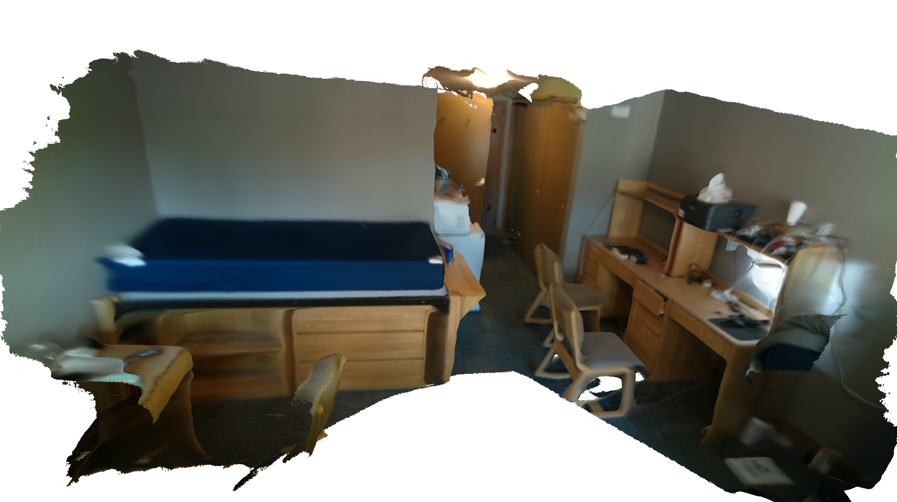

# A Simple Sparse Odometry Based RGBD Reconstruction

This project uses Intel Realsense D435i RGB-D sensor. 

Odometry part uses optical flow tracking and bundle adjustment optimization implemented in g2o.

Reconstruction part uses TSDF Fusion and Marching Cube meshing.

This repo focuses on mapping, here is another repo that focuses on odometry and uses similar code structure. https://github.com/JerryZhang19/Realsense_RGBD_Odometry

## Future work

GPU Implementation

Loop Closure

Sparse map saving in a way suitable for relocalization.

## Reference

slambook2 https://github.com/gaoxiang12/slambook2 gives a great introduction to Visual SLAM.

Code framework of RGB-D Visual Odometry is partly inherited from a stereo Odometry system in the book.

## Dependency

        
* Eigen3,

        sudo apt-get install libeigen3-dev
* Opencv,

* SuiteSparse and CXSparse,

        sudo apt-get install libsuitesparse-dev

* Boost, for format string

        sudo apt-get install libboost-dev libboost-filesystem-dev

* Sophus, for Lie Group computation

        https://github.com/strasdat/Sophus
        
        
* g2o,  for Bundle Adjustment 

        https://github.com/RainerKuemmerle/g2o

* Open3D for TSDF Fusion and Marching Cube meshing

        http://www.open3d.org/

* librealsense,         for realtime reconstruction

        https://github.com/IntelRealSense/librealsense
       
      
