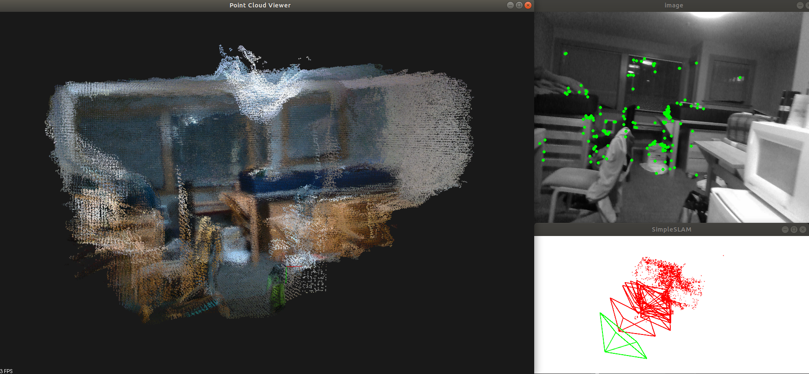

# A Simple Sparse Odometry Based RGBD Reconstruction

This project uses Intel Realsense D435i RGB-D sensor. Here is some preliminary pointcloud reconstruction result.

Odometry part uses optical flow tracking and bundle adjustment optimization implemented in g2o.

This repo focuses on mapping, here is another repo that focuses on odometry and uses similar code structure. https://github.com/JerryZhang19/Realsense_RGBD_Odometry

## Ongoing work
Other reconstruction method like TSDF and Mesh

GPU Reconstruction and realtime paralell reconstruction and localization.

## Future work

Loop Closure

Sparse map saving in a way suitable for relocalization.

## Reference

slambook2 https://github.com/gaoxiang12/slambook2 gives a great introduction to Visual SLAM.

Code framework of RGB-D Visual Odometry part is inherited from slambook2 ch13 (streo odometry).

## Dependency

* CMake,

        sudo apt-get install cmake

* google-glog + gflags,

        sudo apt-get install libgoogle-glog-dev
        
* Eigen3,

        sudo apt-get install libeigen3-dev
* Opencv,

* SuiteSparse and CXSparse,

        sudo apt-get install libsuitesparse-dev

* Boost, for format string

        sudo apt-get install libboost-dev libboost-filesystem-dev

* Sophus, for Lie Group computation

        https://github.com/strasdat/Sophus
        
* Pangolin, for SLAM visualization

        git clone https://github.com/stevenlovegrove/Pangolin.git
        cd Pangolin
        mkdir build
        cd build
        cmake ..
        cmake --build .
        
* g2o,  for Bundle Adjustment 

        https://github.com/RainerKuemmerle/g2o
* pcl,  for reconstruction

        sudo apt-get install libpcl-dev pcl-tools
* librealsense,         for realtime reconstruction

        https://github.com/IntelRealSense/librealsense
       
      
